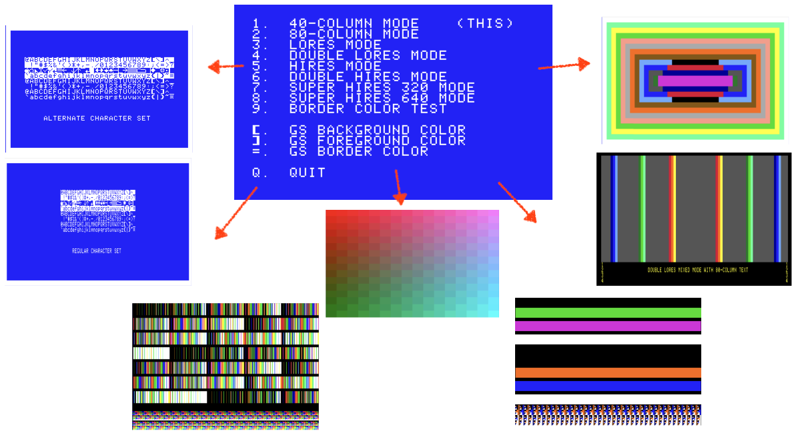

# MiniDisplayTester

This is a program for Apple II computers to test various display modes.  The tests are simple and are intended as an aid for people working on emulators or other hardware such as FPGA cores or video generators.

💾 ([Download Disk Images on the Release page!](https://github.com/digarok/MiniDisplayTester/releases)) 💾

It's designed to run on an Apple II under ProDOS for full compatibility across the line of systems.  However, if you load it to address $2000 and jump to that address it should work without any OS, which is helpful if you haven't emulated an entire Apple II yet.  (It will relocate above to $4000 upon start to be able to draw on the high resolution screen.)

Each mode has multiple tests.  You hit the same key repeatedly to cycle through the tests for that mode. 

I have attempted to support 6502 CPU except for the SHR modes.  I probably have let some 65c02 slip in so feel free to submit bug reports via the issues tab.

### Tests

- 40 Column  "1"
- - Menu Screen 40-col
- - Border Boxes
- - 4:3 Aspect Box
- - Regular Character Set
- - Alternate Character Set
- 80 Column  "2"
- - Menu Screen 80-col
- - Border Boxes
- - 4:3 Aspect Box
- - Regular Character Set
- - Alternate Character Set
- Low Resolution  "3"
- - Color Bands
- - Box "Art"
- - Lo-Res "Coppers" 40-col mixed mode
- - Lo-Res "Coppers" 80-col mixed mode
- - Color Bands 40-col mixed mode w/ labels
- Double Low Resolution  "4"
- - Color Bands
- - Box "Art"
- - Double Lo-Res "Coppers" 40-col mixed mode (NOPE?!)
- - Double Lo-Res "Coppers" 80-col mixed mode
- - Color Bands 80-col mixed mode w/ labels  (TODO!)
- High Resolution   "5"
- - HR Patterns $00 - $FF
- - HR Solid Bars
- - HR Solid Bars 40-col mixed mode
- - HR Solid Bars 80-col mixed mode
- Double High Resolution   "6"
- - DHR Patterns $00 - $FF
- - DHR Solid Bars
- - DHR Solid Bars 40-col mixed mode (NOPE?!)
- - DHR Solid Bars 80-col mixed mode
- - DHR Solid Bars 80-col mixed mode w/ labels
- Super High Resolution (320)   "7"
- - SHR Gradient Bars
- - SHR Test Palette #1
- - SHR Test Palette #2
- Super High Resolution (640)   "8"
- - SHR Gradient Bars
- - SHR Test Palette #1
- - SHR Test Palette #2

You can change text/text bg/border color at any time (Apple IIgs and VidHD only) using the appropriate keys `[`, `]`, and `=`.  It will cycle through all 16 colors and loop back to zero.  

I would like to support the SHR modes on 8-bit Apple II's with VidHD, but currently SHR tests are IIgs only.

You can get disk images from the ([releases](https://github.com/digarok/MiniDisplayTester/releases)) page!

Thanks and good luck!
